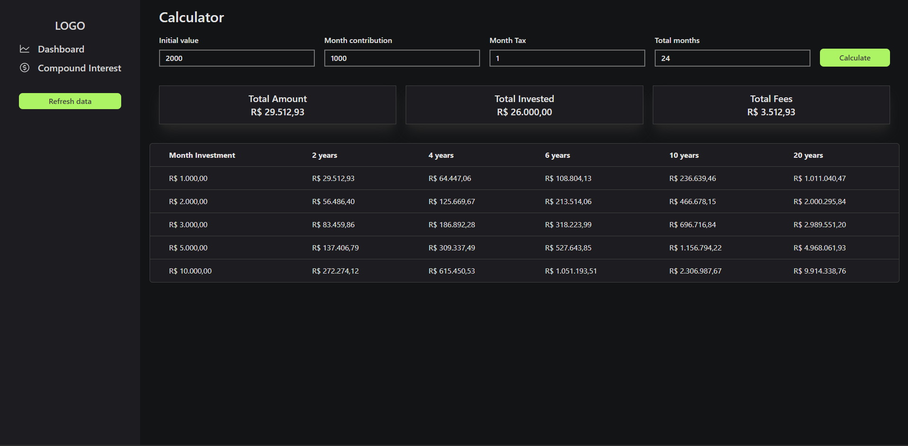

 

<h1>Budget App </h1>

<h3 align="center" style='margin-bottom: 32px'>
Budget App is a personal finance management application. It features automatic integration with your bank, registration of fixed expenses and income, and displays invoice information through charts. Additionally, it includes a compound interest calculator to check investment returns.

</h3>

## 🚀 Technologies

- [React](https://react.dev/) -A JavaScript library for building user interfaces.
- [Tailwind CSS](https://tailwindcss.com/) - A utility-first CSS framework for rapid UI development.
- [Pluggy API](https://www.pluggy.ai/) - API for open finance integration, allowing seamless bank data connectivity.
- [TypeScript](https://www.typescriptlang.org/) - Typed superset of JavaScript that compiles to plain JavaScript.

## 🛠 Key Features

- **Automatic Bank Integration:** Seamlessly synchronize your finances with your bank for real-time updates, ensuring your financial data is always up-to-date and accurate.

- **Fixed Expenses and Income Management:** Effortlessly add and manage recurring expenses and income, providing a clear overview of your financial commitments and earnings.

- **Detailed Invoice Display:** Visualize your financial data through intuitive and interactive charts, helping you track and analyze your spending patterns and financial health.

- **Compound Interest Calculator:** Utilize the built-in compound interest calculator to forecast potential investment returns and make informed financial decisions.

- **User-Friendly Dashboard:** Enjoy a clean and responsive dashboard that consolidates all your financial information in one place, making it easy to navigate and manage your finances on the go.

 

  <h3 align='center'> Developed By Pedro Arruda </h3> 
  
 
 
    
    
  

<h3 align='center'>Feel free to reach out for any questions or collaboration opportunities!
 </h3>
